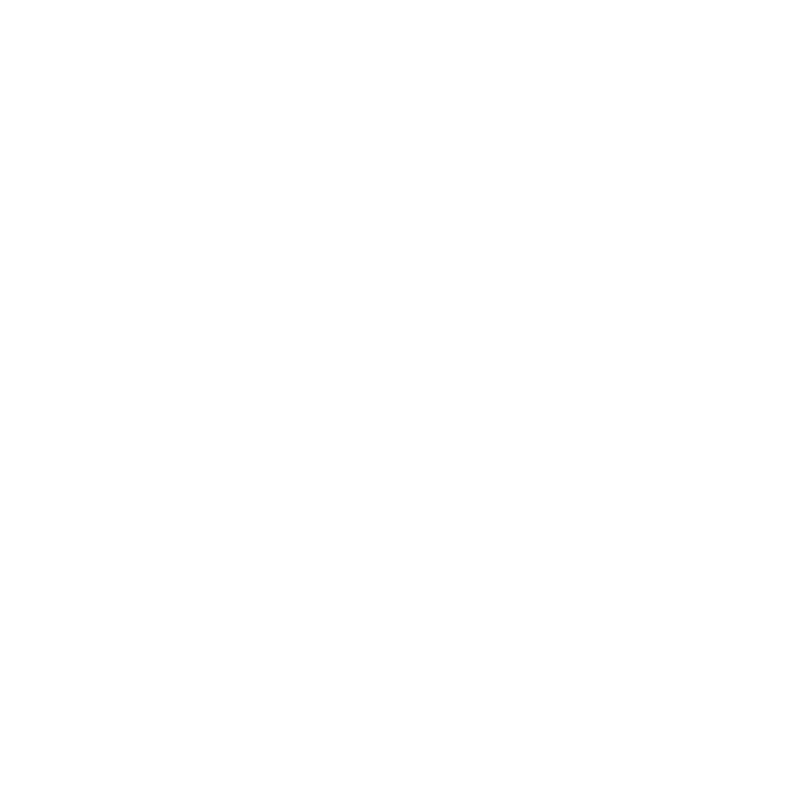

<h1 align='center'>PlayStar - Frontend</h1>
<h3 align='center'>Open source test for startup project that will be provide web application with big backend support that can give you opportunity to play games with money stakes 💰</h3>
 

 

0.1Alpha
<ul>
<li><strike>Main slider</strike>
<li><strike>Horizontal slider without arrows and scrollbar</strike>
<li><strike>Drawer</strike>
<li><strike>Button request on server</strike>
<li><strike>Glow stars</strike>
<li><strike>Refactor code</strike>
<li><strike>Responsive on drawer state change</strike>
<li><strike>Header</strike>
<li><strike>Footer</strike>
<li><strike>Images in image folder</strike>
<li><strike>Framer motion</strike>
</ul>

0.2Alpha
<ul>
<li>Redux Toolkit
<li>Modal windows
<li>React Router v6
<li>Table
<li>React menu for filter 
<li>MOCK
</ul>

